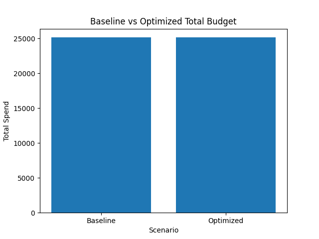
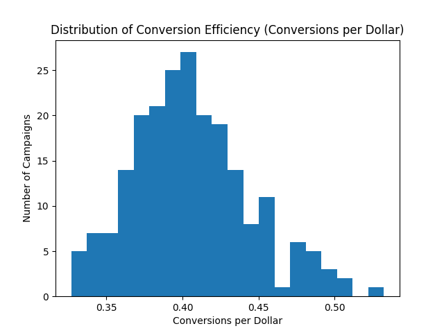
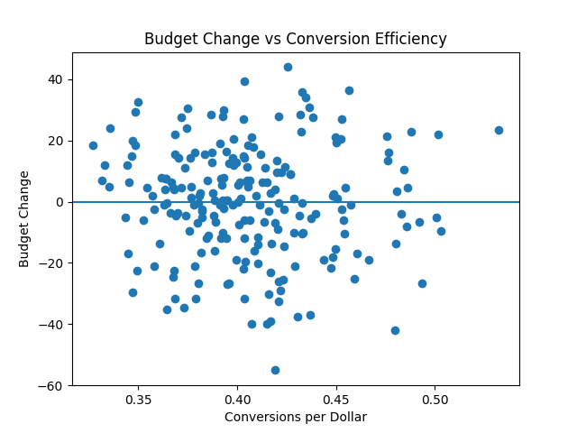

# Marketing Budget Optimization & Performance Analytics

[](https://www.python.org/)
[](https://pandas.pydata.org/)
[](https://numpy.org/)
[](https://matplotlib.org/)
[](https://www.statsmodels.org/)
[](LICENSE)


## Project Overview

This repository presents an **end-to-end marketing analytics pipeline** focused on **campaign performance evaluation and budget reallocation under real-world constraints**.

The objective is **not to maximize metrics at any cost**, but to demonstrate how an analyst or consultant:

* Works with **imperfect, partially observable data**
* Applies **defensible, transparent optimization logic**
* Communicates results clearly — even when **uplift is negligible or negative**

The project mirrors real consulting engagements, where **data limitations and operational constraints** fundamentally shape decision-making.  
**It intentionally demonstrates a scenario where budget optimization does not improve outcomes**, highlighting the importance of honest analysis over forced conclusions.


---

## Business Problem

Marketing teams frequently ask:

> *“How should we reallocate our existing budget to increase conversions?”*

In practice, however:

* True marginal ROI is unknown
* Cost structures are simplified or aggregated
* Performance differences may already be reflected in historical spend

This project evaluates **whether meaningful gains are achievable at all** under these realistic conditions.

**Intended audience**: Marketing leaders, growth analysts, and consultants working with summary-level performance data outside of controlled experimentation environments.

---

## Dataset

Campaign-level **aggregated performance data**, including:

* Impressions
* Clicks
* Expected conversions
* Cost
* Revenue *(included for contextual KPI reporting only; not used in optimization logic)*

Each row represents a **campaign configuration** defined by:

* Ad Type
* Placement
* Topic
* Location

The dataset reflects the type of **summary-level data** commonly available to analysts outside of controlled experimentation environments. The dataset does not include user-level behavior or randomized experimental assignments.

---

## Project Structure

```
Market_Analytics/
├── data/
│   └── raw/
│       └── Dataset_Ads.csv
│   └── processed/
│       ├── ads_consultant_kpi.csv
│       └── campaign_performance_summary.csv
├── notebooks/
│   ├── 01_data_cleaning_kpi_engineering.ipynb
│   ├── 02_campaign_performance_analysis.ipynb
│   ├── 03_budget_optimization.ipynb
│   ├── 04_visualizations.ipynb
│   └── 05_experimental_regression_analysis.ipynb
├── reports/
│   ├── Marketing_Budget_Optimization_Client_Report.pdf
│   └── budget_optimization_results.csv
├── visuals/
│   ├──baseline_vs_optimized_budget.png
│   ├──budget_change_vs_efficiency.png
│   └──conversion_efficiency_distribution.png
├── LICENSE
├── requirements.txt
└── README.md
```

---

## Methodology

### 1. KPI Engineering

Key performance indicators were derived using **observed historical data only**:

* Conversion Rate (CVR)
* Cost per Click (CPC)
* Conversions per Dollar *(primary optimization metric)*
* Spend Share

No synthetic uplift or fabricated performance gains were introduced; all estimates rely on observed historical relationships under clearly stated assumptions.

---

### 2. Campaign Performance Analysis

Campaigns were evaluated across:

* Efficiency distributions
* Rank-based comparisons
* Variance across segments (ad type, placement, topic, location)

This analysis established **how much performance heterogeneity actually exists** before attempting optimization.

---

### 3. Budget Optimization Strategy

A **fixed total budget** was reallocated using:

* **Efficiency-weighted allocation** based on conversions per dollar
* Minimum and maximum spend constraints to avoid unrealistic outcomes
* Full re-normalization to preserve total spend

**Important:**
This is a **directional optimization**, not a revenue or growth forecast.

---

### 4. Impact Estimation

Expected outcomes were calculated using:

* Observed CPC
* Stable conversion rate assumptions
* No diminishing returns or saturation modeling

This reflects a **conservative, defensible approach** consistent with real-world consulting practices.

---

## Key Results

| Metric               | Baseline  | Optimized  |
| -------------------- | --------- | ---------- |
| Total Budget         | 25,153    | 25,153     |
| Expected Conversions | 10,214.61 | 10,208.54  |
| Conversion Lift      | —         | **-0.06%** |

### Interpretation

* Budget reallocation **did not produce material uplift**
* Efficiency differences exist but are **tightly clustered**
* Historical spend already reflects relative campaign performance

---

## Visualization Insights

The visual analysis explains *why* uplift is minimal:

### Budget Comparison

* Total spend remains fixed (by design)
  
*Figure 1. Baseline vs Optimized Total Budget Allocation*

### Efficiency Distribution

* Conversion efficiency is **tightly clustered**
* Few extreme outliers exist to exploit
  
*Figure 2. Conversion Efficiency Distribution*

### Budget Change vs. Efficiency

* Weak relationship between efficiency and feasible budget shifts
* Spend constraints limit concentration effects
  
*Figure 3. Budget Change vs Efficiency*

### Top vs. Bottom Campaign Efficiency Comparison

| Group     | Avg Conversion Rate | Avg Conversions per Dollar |
|-----------|---------------------|----------------------------|
| Top 10    | 0.2484              | 0.4968                     |
| Bottom 10 | 0.1693              | 0.3386                     |

- Top-performing campaigns are approximately **47% more efficient**
- However, these campaigns account for a **limited share of total spend**
- Budget constraints and already-optimized allocation limit the impact of reallocation

---

## Why “No Uplift” Is Still a Strong Result

In professional analytics work:

* Demonstrating **why optimization does not work** is often more valuable than forcing gains
* This prevents overconfidence, wasted experimentation, and unrealistic stakeholder expectations

**Strategic insight delivered:**

> The system is already near-optimized under current constraints.
> Meaningful improvements would require **new channels, creatives, targeting strategies, or experimentation**, not simple budget redistribution.

---

## Limitations & Assumptions

* Conversion rates assumed stable under moderate budget shifts
* No saturation or diminishing returns modeled
* No true marginal cost or incrementality data available

These limitations are **explicitly acknowledged and documented**, not hidden.

---

## Experimental & Regression Analysis

To assess whether higher-efficiency campaigns truly convert better — beyond budget mechanics — two complementary analyses were conducted.

### Quasi A/B Test (Top vs Bottom Efficiency)

Campaigns were segmented into high- and low-efficiency groups based on historical conversions per dollar.

A two-sample Welch t-test shows that high-efficiency campaigns have **statistically higher conversion rates** than low-efficiency campaigns (p < 0.001), confirming that efficiency differences are real rather than random noise.

However, statistical separation alone does not guarantee that budget reallocation will produce material gains.

---

### Regression Analysis (Structural Drivers)

An OLS regression was used to quantify whether observable budget-related variables explain conversion rate differences:

**Dependent variable**
- Conversion Rate

**Independent variables**
- Cost per Click (CPC)
- Total Spend
- Impressions

**Key result**

- Model R² = **0.003**
- Joint model significance: **Not significant (p = 0.70)**

**Interpretation**

While CPC shows a statistically detectable association with conversion rate, the model explains virtually none of the observed variance.  
This indicates that **conversion performance is not meaningfully driven by budget mechanics or spend scale alone**.

**Strategic implication**

> Meaningful performance improvements require changes in campaign design, creative quality, targeting, or experimentation — not simple budget redistribution.

This finding directly explains why budget optimization resulted in negligible uplift.

---

## Skills Demonstrated

* Marketing analytics
* KPI engineering
* Constraint-aware optimization
* Business-focused data storytelling
* Honest result communication
* Client-ready notebook and reporting structure

---

## How to Run
1. Install dependencies: `pip install -r requirements.txt`
2. Run notebooks in order from `01_` to `05_`

---

## Disclaimer

This project is provided for portfolio and demonstration purposes only.

- It does not constitute marketing, financial, or investment advice
- Results are context-dependent and based on simplified assumptions
- Real-world decisions require experimentation, incrementality testing, and domain expertise

---

## Author

**Medical AI & Healthcare Data Science Consultant**

Physician (MBBS) with a Master’s in Global Communication and professional training in Machine Learning, Deep Learning, NLP, and AI for Medicine. Experienced in building interpretable risk models and decision-support systems for regulated, data-sensitive environments.
